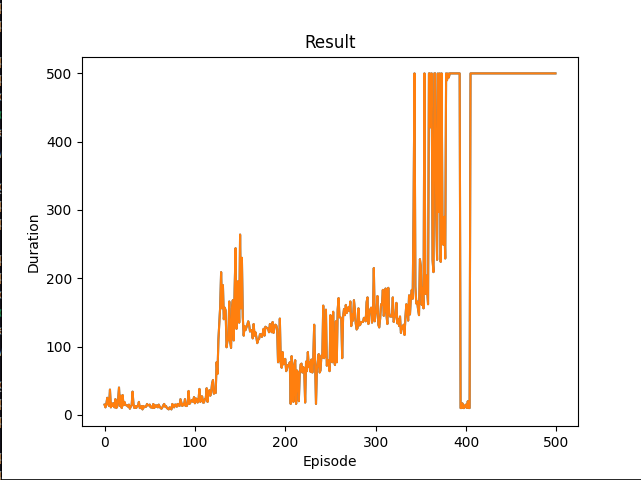

# Problem CartPole przy użyciu DQN

Projekt został przeze mnie napisany przy okazji nauki o uczeniu ze wzmocnieniem.

Rozwiązanie bazuje na oficjalnym [poradniku DQN PyTorch'a](https://pytorch.org/tutorials/intermediate/reinforcement_q_learning.html).

Po wyszkoleniu modelu, zostaje uruchomiona testowa symulacja, która tworzy film ilustrujący działanie finalnego modelu.

## Uruchamianie
```
sudo apt-get install python3-tk ffmpeg
pip3 install -r requirements.txt
python3 -m main --config ml_config/config.yaml
```

## Wyniki 

Poniżej znajdują się wykresy obrazujące wyniki z trzech eksperymentów:




Wizualizacja działania modelu wyszkolonego podczas pierwszego eksperymentu: [wizualizacja](results/visualization.mp4)